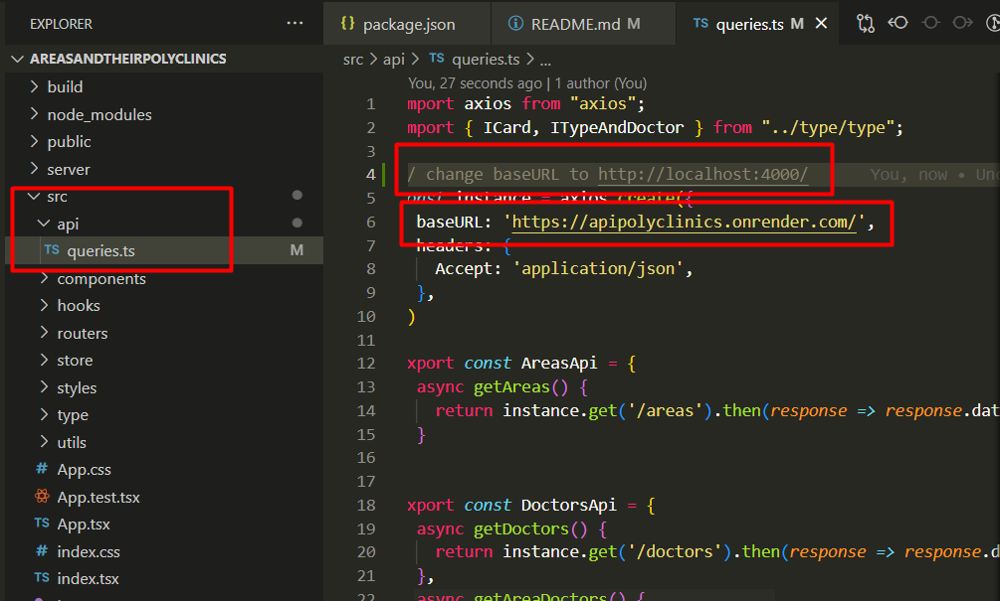

# Areas and Their Polyclinics
You can explore the website at this link https://gamlock-glou.github.io/AreasAndTheirPolyclinics/
## Tech stack

+ Redux
+ TypeScript
+ React
+ JSON-Server (as a pseudo backend)

## libraries in frontend

+ redux/toolkit
+ mui
+ sass
+ react router dom v6
+ classnames
+ axios
+ formik
+ typescript

## Pseudo backend
You can get acquainted with the API at this [link](https://apipolyclinics.onrender.com/)
Detailed information can be found [here](https://github.com/GamLock-glou/apiPolyclinics)

## How to start?

```node
  yarn install
  yarn start
```

### If you want working with server:

If you also want to work with the json-server, you don't have to clone the repository described above. You should go to the file shown in the picture and change the baseUrl (Read the comment). After that, you need to register the commands:

```node
  yarn install
  yarn dev
```


